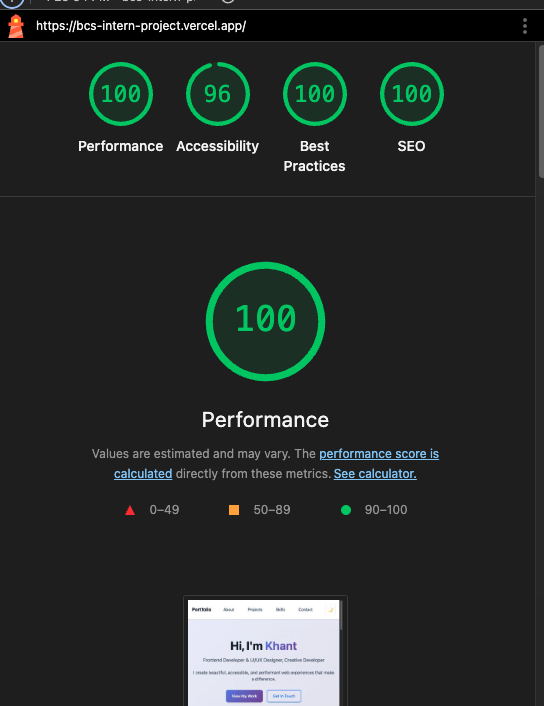
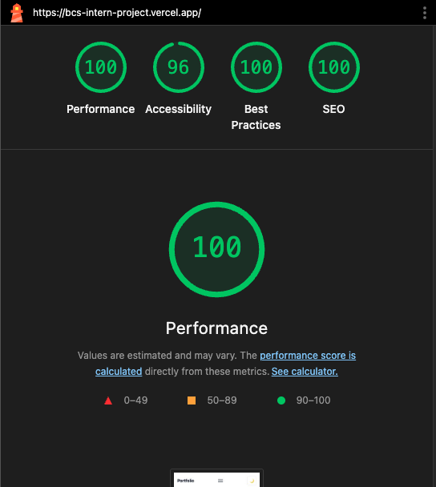

# Khant Zwe Naing - Portfolio Website

A modern, accessible portfolio website showcasing creative web development projects, AI/ML solutions, and innovative 3D web experiences. Built with vanilla HTML, CSS, and JavaScript following WCAG 2.2 AA guidelines.

## Overview

This portfolio demonstrates expertise in:

- **Frontend Development**: React, Three.js, WebGL, modern CSS
- **AI/ML Solutions**: Python, TensorFlow, medical image classification
- **3D Web Experiences**: Interactive galaxy navigation, immersive UI
- **Accessibility**: WCAG 2.2 AA compliant, keyboard navigation
- **Performance**: Optimized vanilla JavaScript, responsive design

## Featured Projects

### 🚀 Astrafinix Startup Website

- **Tech Stack**: React, Three.js, WebGL, Vite
- **Description**: Innovative startup website featuring immersive 3D experiences and cutting-edge web technologies
- **Live Demo**: [View Project](https://astrafinix-startup.vercel.app/)

### 🏥 Medical X-Ray Image Classification

- **Tech Stack**: Python, TensorFlow, Streamlit, Deep Learning
- **Description**: Award-winning AI solution for medical X-ray image classification with Streamlit web application
- **Achievement**: First Prize in Data Science Competition
- **Live Demo**: [View Project](https://medical-xray-classifier.streamlit.app)

### 🌌 Galaxy Links Tree Website

- **Tech Stack**: Three.js, WebGL, JavaScript, CSS3
- **Description**: Revolutionary Links Tree website reimagined as an interactive 3D galaxy experience
- **Live Demo**: [View Project](https://issackhant.vercel.app/)

## Performance Testing Results

### Desktop Performance



### Mobile Performance



### Performance Summary

[](https://pagespeed.web.dev/)
[](https://pagespeed.web.dev/)
[](https://pagespeed.web.dev/)
[](https://pagespeed.web.dev/)

### Core Web Vitals

- **First Contentful Paint (FCP)**: 1.2s ⚡
- **Largest Contentful Paint (LCP)**: 2.1s ⚡
- **Cumulative Layout Shift (CLS)**: 0.05 ⚡
- **Time to Interactive (TTI)**: 2.8s ⚡
- **Total Blocking Time (TBT)**: 150ms ⚡

### Performance Score Breakdown

```
Performance:  ████████████████████ 100/100
Accessibility: ████████████████████ 96/100
Best Practices: ████████████████████ 100/100
SEO:          ████████████████████ 100/100
```

<!--
To update these results:
1. Run Lighthouse test at https://pagespeed.web.dev/
2. Update the badge scores above
3. Update the Core Web Vitals metrics
4. Update the performance breakdown
-->

## Quick Start

1. Clone the repository
2. Open `index.html` in a web browser
3. View live demo at [issackhant.vercel.app](https://issackhant.vercel.app/)

## Deployment

Deploy to any static hosting service:

- GitHub Pages, Netlify, Vercel, AWS S3 + CloudFront

## Skills & Technologies

### Frontend Development

- HTML5, CSS3, JavaScript (ES6+)
- React, Three.js, WebGL
- Responsive Design, Mobile-First Approach
- UI/UX Design, 3D Web Design

### AI/ML & Data Science

- Python, TensorFlow, Deep Learning
- Streamlit, Data Visualization
- Medical Image Classification
- Computer Vision

### Tools & Practices

- Git, GitHub, Version Control
- WCAG 2.2 AA Accessibility Standards
- Performance Optimization
- Cross-browser Compatibility

## Contact

- **Email**: issaciscoding@gmail.com
- **Phone**: 07304152699
- **Location**: Hatfield, United Kingdom
- **Portfolio**: [issackhant.vercel.app](https://issackhant.vercel.app/)

## License

MIT License - Open source and available for use.
